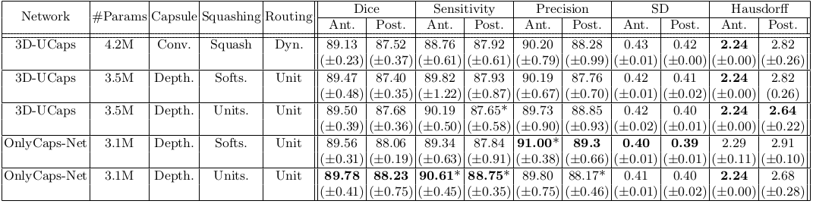

* [Introduction](#OnlyCaps-Net,-a-capsule-only-based-neural-network-for-2D-and-3D-semantic-segmentation)
* [Usage](#usage)

# OnlyCaps-Net, a capsule only based neural network for 2D and 3D semantic segmentation

OnlyCaps-Net is a 3D capsule-only semantic segmentation network for medical imaging. 
In this paper we introduce two novel squashing functions (UnitSquash and Softsquash), Unit routing, a novel parameters-free and iteration-free routing algorithm, and a parameters efficient convolutional capsule, i.e Depthwise Convolutional Capsule.
Modifying a 3D-UCaps, using our depthwise convolutional capsule with unit squashing and unit routing, leads to a ∼29% time speed up with a ∼35% memory footprint reduction.


Details and comparison between OnlyCaps and 3D-UCaps model architecture and experimental results can be found in our paper:
```
@inproceedings{bonheur2022onlycaps,
  title={OnlyCaps-Net, a Capsule only Based Neural Network for 2D and 3D Semantic Segmentation},
  author={Bonheur, Savinien and Thaler, Franz and Pienn, Michael and Olschewski, Horst and Bischof, Horst and Urschler, Martin},
  booktitle={International Conference on Medical Image Computing and Computer-Assisted Intervention},
  pages={340--349},
  year={2022},
  organization={Springer}
}
```

## Usage (copied from 3D-Ucaps repository [link](https://github.com/VinAIResearch/3D-UCaps))

### Installation
We provide instructions on how to install dependencies via conda. First, clone the repository locally:
```
git clone https://github.com/savinienb/OnlyCaps-Net
```

Then, install dependencies depends on your cuda version. We provide two versions for CUDA 10 and CUDA 11
```
conda env create -f environment_cuda11.yml
or
conda env create -f environment_cuda10.yml
```

### Data preparation
Download and extract these datasets:
* iSeg-2017 challenge (infant brain MRI segmentation): <https://iseg2017.web.unc.edu/download/>
* Lung Nodule Analysis 2016 (LUNA16): <https://luna16.grand-challenge.org/Download/>
* Cardiac and Hippocampus dataset from Medical Segmentation Decathlon: <http://medicaldecathlon.com/>

We expect the directory structure to be the following:
```
path/to/iseg/
  domainA/
  domainA_val/

path/to/cardiac/
  imagesTr
  labelsTr

path/to/hippocampus/
  imagesTr
  labelsTr

path/to/luna/
  imgs
  segs
```

**Note**: there are some files in LUNA16 dataset can lead to an error when training so we have removed it:
```
1.3.6.1.4.1.14519.5.2.1.6279.6001.771741891125176943862272696845.mhd
1.3.6.1.4.1.14519.5.2.1.6279.6001.927394449308471452920270961822.mhd
```

### Training

Arguments for training can be divided into 3 groups:

1. Trainer args to initialize [Trainer](https://pytorch-lightning.readthedocs.io/en/latest/common/trainer.html#trainer-class-api) class from Pytorch Lightning.

   * Important arguments: `gpus`, `accelerator`, `check_val_every_n_epoch`, `max_epochs`.
   * Fix arguments in `train.py`: `benchmark`, `logger`, `callbacks`, `num_sanity_val_steps`, `terminate_on_nan` 
2. Model args depend on which model you use (UCaps, SegCaps or U-net) and defined in `add_model_specific_args` method of that module. 

   * Important arguments: `in_channels`, `out_channels`, `val_frequency`, `val_patch_size`, `sw_batch_size`, `overlap`. The last three args are use in [sliding window inference](https://docs.monai.io/en/latest/inferers.html#sliding-window-inference) method from MONAI library.
3. Args specific for training: `root_dir`, `log_dir`, `dataset`, `fold`, `cache_rate`, `cache_dir`, `model_name`, `train_patch_size`, `num_workers`, `batch_size`, `num_samples`.

   * `cache_rate` and `cache_dir` define whether you want to use [CacheDataset](https://docs.monai.io/en/latest/data.html?highlight=ThreadBuffer#cachedataset) or [PersistentDataset](https://docs.monai.io/en/latest/data.html?highlight=ThreadBuffer#persistentdataset) when loading data.
   * `num_samples` is a arg in [RandCropByPosNegLabel](https://docs.monai.io/en/latest/transforms.html#randcropbyposneglabel) method, the effective batch size is `batch_size` x `num_samples`.

The full list of arguments can be shown through the command:
```
python train.py -h
```

We provide bash script with our config to train UCaps model on all datasets and can be run as follow:
```
bash scripts/train_ucaps_iseg.sh
```

### Validation
Arguments for validation can be divided into 3 groups:

1. Trainer args to initialize [Trainer](https://pytorch-lightning.readthedocs.io/en/latest/common/trainer.html#trainer-class-api) class. The only argument we need to use here is `gpus`.
2. Args for [sliding window inference](https://docs.monai.io/en/latest/inferers.html#sliding-window-inference) method
3. Args specific for validation `root_dir`, `output_dir`, `save_image`, `model_name`, `dataset`, `fold`, `checkpoint_path`

The full list of arguments can be shown through the command:
```
python evaluate.py -h
```

We provide bash script with our config to validate trained UCaps models on all datasets, you just need to download our models in [Model Zoo](#model-zoo) and put them in `logs` folder. After that, you can run the evaluation script for targeted dataset as follow:
```
bash scripts/evaluate_ucaps_iseg.sh
```
### Fully automatic training and testing:

In the scripts folder two bash files, train_all_hippocampus.sh and test_all_hippocampus.sh, allows to run the comparison between 3D-Ucaps and OnlyCaps-Net

### Implementation Note
Two Depthwise separable convolutional capsule implementation (DepthwiseCaps4d) exist in the layers.py file.
Those two implementations present different speed/memory tradeoff (by default the implementation is the one used in the paper speed/memory comparison)

### OnlyCaps-Net/3D-UCaps comparison on hippocampus dataset with 4-folds cross-validation:
Averages of the four cross-fold metrics for the evaluated networks on the 3D Hippocampus dataset. Dice score, Sensitivity and Precision in %. SD represent Standard Distance and Hausdorff represent Hausdorff Distance. Conv. represents the use of convolutional capsules [4] and Depth. the use of depthwise separable convolutional capsules. Dyn. indicates the use of dynamic routing. Softs. and Units. stand for the softsquash and unitsquash function, respectively. Ant. and Post. indicate Anterior and Posterior respectively. The number of network parameters is shown in millions. * indicate statistical significance p<0.05.



## Acknowledgement
This ReadMe and implementation relies heavily on the 3D-Ucaps repository [link](https://github.com/VinAIResearch/3D-UCaps)

